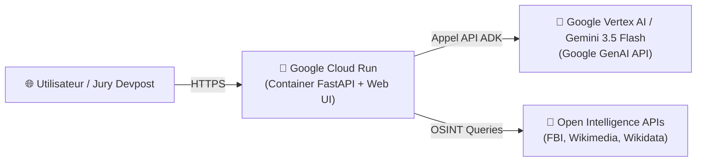

# ☁️ Guide de Déploiement Google Cloud & Vertex AI

> **ColdCase Agentic OS sur Google Cloud Run & Vertex AI / Gemini 3.5**  
> *Déploiement serverless ultra-rapide, sécurisé et scalable.*

---

## 🎯 1. Vue d'Ensemble de l'Architecture Cloud



* **Frontend & Backend unifiés** hébergés sur **Google Cloud Run** (Serverless, HTTPS automatique, mise à l'échelle automatique de 0 à N instances).
* **Intelligence Multi-Agents** propulsée par **Google ADK & Vertex AI / Gemini 3.5 Flash**.

---

## 🚀 2. Déploiement en 1 Clic sur Google Cloud Run

### Option A : Déploiement Direct avec Google Cloud CLI (`gcloud`)

Ouvrez votre terminal PowerShell dans le dossier `coldcase-detective-ai` :

```powershell
# 1. Connectez-vous à votre compte Google Cloud
gcloud auth login

# 2. Définissez votre ID de projet Google Cloud
gcloud config set project VOTRE_PROJECT_ID

# 3. Déployez directement sur Cloud Run (Build & Run automatique)
gcloud run deploy coldcase-agentic-os `
  --source . `
  --region us-central1 `
  --allow-unauthenticated `
  --set-env-vars GOOGLE_API_KEY="VOTRE_CLE_GEMINI",MOCK_MODE="0"
```

👉 **Google Cloud vous fournira instantanément une URL publique HTTPS sécurisée** (ex: `https://coldcase-agentic-os-xyz-uc.a.run.app`) que vous pouvez coller directement dans votre soumission Devpost !

---

### Option B : Déploiement avec Google ADK CLI

Si vous utilisez `google-adk` en ligne de commande :

```powershell
adk deploy cloud_run --project=VOTRE_PROJECT_ID --region=us-central1 coldcase_agent
```

---

## 🔑 3. Variables d'Environnement Google Cloud

| Variable | Description | Valeur Recommandée en Production |
|---|---|---|
| `GOOGLE_API_KEY` | Clé API Google Gemini / Vertex AI | Votre clé API Google AI Studio / Vertex |
| `MOCK_MODE` | Mode de secours déterministe (0 = Live Gemini, 1 = Canned fallback) | `0` (Live Gemini) ou `1` (Démo infaillible) |
| `PORT` | Port d'écoute du conteneur Cloud Run | `8080` (Standard Cloud Run) |

---

## 🛡️ 4. Avantages pour le Jury Hackathon

1. **100% Serverless & Scalable** : Zéro coût d'infrastructure quand l'application ne reçoit pas de trafic (Scale to Zero).
2. **Intégration Native Google Cloud & Gemini** : Répond parfaitement aux critères d'évaluation des hackathons Google / Devpost.
3. **Haute Disponibilité** : Accompagné d'un fallback intelligent garantissant zéro plantage lors des évaluations du jury.
