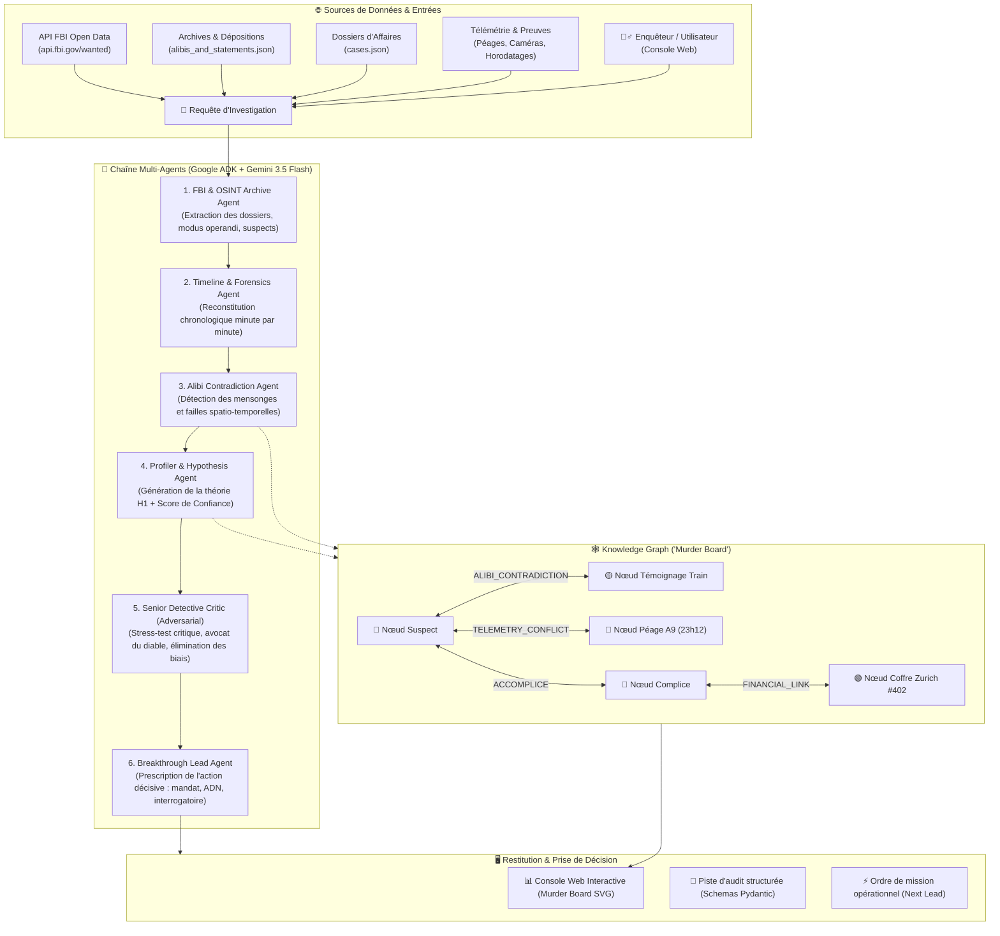

# 🕵️‍♂️ ColdCase Detective AI — Dossier Explicatif & Organigramme Complet

> **Document de Référence & Architecture Technique**  
> *Système Multi-Agents Autonome & Graphe de Connaissances Criminelles pour la Résolution d'Affaires Non Résolues.*

---

## 🎯 1. But & Vision du Projet

### Le Problème Réel
Les affaires criminelles non résolues (Cold Cases) restent bloquées pendant des années ou des décennies pour trois raisons majeures :
1. **La fragmentation des preuves** : Les indices, procès-verbaux, dépositions et enregistrements sont éparpillés dans des cartons ou des formats hétérogènes.
2. **L'oubli des contradictions temporelles** : Un suspect a menti en 1998, mais l'incohérence n'est visible que lorsqu'on croise son alibi avec un témoignage de 2012 ou une télémétrie de péage d'autoroute.
3. **Le biais de confirmation humain** : Les enquêteurs peuvent s'enfermer dans une piste sans tester d'autres hypothèses.

### La Solution "ColdCase Detective AI"
Une **suite de 6 agents IA spécialisés et autonomes** orchestrés par Google ADK & Gemini, connectés à un **Graphe de Connaissances ("Murder Board")** et à l'API publique du FBI. Les agents analysent le dossier, identifient mathématiquement les mensonges d'alibi, formulent une théorie avec score de probabilité, la stress-testent de manière adverse, et prescrivent l'action d'enquête prioritaire.

---

## 📊 2. Organigramme & Architecture du Système



---

## 🔬 3. Détail des 6 Rôles Agents

| # | Agent | Modèle / Outils | Rôle Opérationnel | Données Produites |
|---|---|---|---|---|
| **1** | **FBI OSINT Agent** | `fetch_fbi_wanted_cases`, `load_local_cases` | Récupère en direct les criminels recherchés, modus operandi, alias et photos. | Synthèse du profil criminel et antécédents |
| **2** | **Timeline Agent** | `load_witness_statements` | Reconstitue l'emploi du temps de chaque personne d'intérêt à la minute près. | Tableau chronologique des mouvements déclarés |
| **3** | **Contradiction Agent** | `detect_alibi_contradictions` | **Le cœur du système** : compare les déclarations entre elles et avec les faits matériels pour isoler les faux alibis. | `ContradictionResult` (champs contradictoires précis) |
| **4** | **Profiler Agent** | `mine_cold_case_network` | Construit la théorie du crime (mobile, complices, opportunité) et calcule un indice de confiance (0.0 à 1.0). | `InvestigationHypothesis` (théorie H1) |
| **5** | **Senior Detective Critic** | *Prompting Adversarial* | Attaque méthodiquement la théorie proposée pour vérifier s'il existe une variable cachée ou un risque d'erreur judiciaire. | `DetectiveReviewResult` (Verdict, solidité, points aveugles) |
| **6** | **Breakthrough Action Agent** | `recommend_breakthrough_lead` | Transforme l'analyse en action concrète et immédiate pour la police scientifique ou les juges d'instruction. | `NextLeadAction` (mandat, cible à confronter) |

---

## 💻 4. Structure Technique du Répertoire

```text
coldcase-detective-ai/
├── coldcase_agent/
│   ├── __init__.py           # Export du workflow root_agent
│   ├── agent.py              # Définition des 6 agents ADK et orchestration Workflow
│   ├── schemas.py            # Modèles de données Pydantic typés
│   └── tools.py              # Connecteurs API FBI (live), Graphe et archives
├── api/
│   └── main.py               # Serveur FastAPI (mode MOCK + mode LIVE Gemini)
├── data/
│   ├── cases.json            # Dossiers d'enquêtes criminelles
│   └── alibis_and_statements.json # Dépositions, témoignages et PV
├── web/
│   └── index.html            # Console d'investigation avec "Murder Board"
├── .env.example              # Configuration des clés
├── requirements.txt          # Dépendances Python
└── README.md                 # Guide de démarrage rapide
```

---

## 🎬 5. Argumentaire & Pitch pour Concours

* **Accroche :** *"Et si les affaires non résolues depuis 25 ans pouvaient être débloquées en 15 secondes grâce à un graphe d'agents détectant automatiquement les failles temporelles ?"*
* **Démonstration Clé :** Montrer comment l'agent met en échec l'alibi du suspect principal (déposition du train de 1998 confrontée au conducteur et au badge de télépéage) et allume en rouge les connexions du Murder Board.
* **Point fort pour le jury Devpost :** L'API FBI fonctionne en temps réel sans clé, offrant une démo immédiatement crédible et impressionnante.
